# Enhanced Cloud Native Notification Microservice Design

This approach combines domain-driven design principles with AWS cloud-native services to create a robust, scalable notification microservice that minimizes operational overhead while maintaining strong domain boundaries.

## Architecture Philosophy
"Let the cloud provider manage the infrastructure while maintaining rich domain models." We compose the solution using AWS managed services (Lambda, SQS, EventBridge, DynamoDB, SES/SNS) while applying DDD principles to ensure clean domain boundaries, rich behavior, and maintainable code.

## Domain-Driven Design Foundation

### Bounded Context: **Notification**
This microservice owns the complete lifecycle of notification processing - from request creation through delivery confirmation. It doesn't concern itself with *why* notifications are needed (that's other bounded contexts), only *what* to send, *to whom*, *how*, and *when*.

### Core Aggregates

#### 1. **NotificationRequest** (Aggregate Root)
Represents the intent and lifecycle of sending a notification.

**Entities:**
- `Recipient` - Encapsulates recipient details with channel-specific addresses

**Value Objects:**
- `NotificationRequestId` - Unique identifier for the request
- `MessagePayload` - Content structure (title, body, rich content, data payload)
- `NotificationType` - Classification (e.g., "SystemAlert", "RequirementDue", "OrderConfirmed")
- `ChannelPreferences` - Ordered list of preferred channels with fallback logic
- `Urgency` - Priority level (High, Medium, Low)
- `ScheduledTime` - Optional delayed delivery timestamp
- `CorrelationId` - Links to originating business process
- `NotificationStatus` - Current state (Pending, Processing, Completed, Failed)

**Domain Behaviors:**
```csharp
public class NotificationRequest : AggregateRoot<NotificationRequestId>
{
    public static NotificationRequest Create(
        NotificationType type, 
        MessagePayload payload, 
        IEnumerable<Recipient> recipients,
        ChannelPreferences channelPrefs,
        CorrelationId correlationId)
    {
        // Validation and business rules
        var request = new NotificationRequest(/* parameters */);
        request.RaiseDomainEvent(new NotificationRequestedEvent(request.Id));
        return request;
    }

    public void MarkAsProcessing()
    {
        if (Status != NotificationStatus.Pending)
            throw new InvalidOperationException("Cannot process non-pending notification");
        
        Status = NotificationStatus.Processing;
        RaiseDomainEvent(new NotificationProcessingStartedEvent(Id));
    }

    public void MarkAsCompleted()
    {
        Status = NotificationStatus.Completed;
        RaiseDomainEvent(new NotificationCompletedEvent(Id));
    }

    public void MarkAsFailed(string reason)
    {
        Status = NotificationStatus.Failed;
        RaiseDomainEvent(new NotificationFailedEvent(Id, reason));
    }
}
```

#### 2. **SentNotificationLog** (Aggregate Root)
Tracks actual delivery attempts and outcomes for audit and monitoring.

**Entities:**
- `DeliveryAttempt` - Individual attempt records with timestamps and outcomes

**Value Objects:**
- `SentNotificationLogId` - Unique identifier
- `OriginalNotificationRequestId` - Reference to source request
- `ChannelType` - Delivery channel used
- `RecipientAddress` - Actual delivery address
- `DeliveryStatus` - Current delivery state
- `DeliveryTimestamp` - When delivery was attempted
- `FailureReason` - Error details if applicable

**Domain Behaviors:**
```csharp
public class SentNotificationLog : AggregateRoot<SentNotificationLogId>
{
    public static SentNotificationLog RecordDispatchAttempt(
        NotificationRequestId requestId,
        ChannelType channel,
        RecipientAddress address)
    {
        var log = new SentNotificationLog(requestId, channel, address);
        log.RaiseDomainEvent(new NotificationDispatchAttemptedEvent(log.Id));
        return log;
    }

    public void UpdateDeliveryStatus(DeliveryStatus status, string reason = null)
    {
        var attempt = new DeliveryAttempt(DateTime.UtcNow, status, reason);
        _deliveryAttempts.Add(attempt);
        
        RaiseDomainEvent(status == DeliveryStatus.Delivered 
            ? new NotificationDeliveredEvent(Id)
            : new NotificationDeliveryFailedEvent(Id, reason));
    }
}
```

#### 3. **NotificationTemplate** (Aggregate Root)
Manages reusable notification templates with versioning support.

**Value Objects:**
- `TemplateId` - Unique identifier
- `TemplateName` - Human-readable name
- `ChannelType` - Target channel (Email, SMS, Push)
- `SubjectTemplate` - Subject line template (for email)
- `BodyTemplate` - Message body with placeholders
- `TemplateVersion` - Version tracking for backward compatibility
- `TemplateStatus` - Active, Draft, Deprecated

**Domain Behaviors:**
```csharp
public class NotificationTemplate : AggregateRoot<TemplateId>
{
    public NotificationTemplate CreateNewVersion(string bodyTemplate, string subjectTemplate = null)
    {
        var newVersion = new NotificationTemplate(
            Id, Name, ChannelType, bodyTemplate, subjectTemplate, Version.Increment());
        newVersion.RaiseDomainEvent(new NotificationTemplateVersionCreatedEvent(Id, newVersion.Version));
        return newVersion;
    }

    public RenderedMessage RenderMessage(IDictionary<string, object> data)
    {
        // Template rendering logic with placeholder substitution
        return new RenderedMessage(
            RenderSubject(data),
            RenderBody(data));
    }
}
```

#### 4. **UserNotificationPreferences** (Aggregate Root)
Manages per-user notification settings and policies.

**Value Objects:**
- `UserId` - User identifier
- `NotificationTypePreference` - Per-type channel preferences
- `DoNotDisturbSchedule` - Quiet hours configuration
- `FrequencyLimits` - Rate limiting rules
- `ChannelSubscription` - Opt-in/opt-out status per channel

**Domain Behaviors:**
```csharp
public class UserNotificationPreferences : AggregateRoot<UserId>
{
    public void UpdateChannelPreference(NotificationType type, ChannelType channel, bool enabled)
    {
        var preference = _preferences.FirstOrDefault(p => p.Type == type);
        if (preference == null)
        {
            preference = new NotificationTypePreference(type);
            _preferences.Add(preference);
        }
        
        preference.SetChannelEnabled(channel, enabled);
        RaiseDomainEvent(new UserNotificationPreferencesUpdatedEvent(UserId, type, channel, enabled));
    }

    public bool ShouldReceiveNotification(NotificationType type, ChannelType channel, DateTime scheduledTime)
    {
        // Apply do-not-disturb, frequency limits, and channel preferences
        return IsChannelEnabled(type, channel) 
            && !IsInDoNotDisturbPeriod(scheduledTime)
            && !ExceedsFrequencyLimit(type);
    }
}
```

### Domain Events

```csharp
// Core notification lifecycle events
public record NotificationRequestedEvent(NotificationRequestId RequestId, DateTime OccurredOn);
public record NotificationProcessingStartedEvent(NotificationRequestId RequestId, DateTime OccurredOn);
public record NotificationReadyToDispatchEvent(NotificationRequestId RequestId, ChannelType Channel, DateTime OccurredOn);
public record NotificationDispatchAttemptedEvent(SentNotificationLogId LogId, DateTime OccurredOn);
public record NotificationSentToChannelEvent(SentNotificationLogId LogId, ChannelType Channel, DateTime OccurredOn);
public record NotificationDeliveredEvent(SentNotificationLogId LogId, DateTime OccurredOn);
public record NotificationDeliveryFailedEvent(SentNotificationLogId LogId, string Reason, DateTime OccurredOn);
public record NotificationFailedEvent(NotificationRequestId RequestId, string Reason, DateTime OccurredOn);
public record NotificationCompletedEvent(NotificationRequestId RequestId, DateTime OccurredOn);

// Template management events
public record NotificationTemplateCreatedEvent(TemplateId TemplateId, DateTime OccurredOn);
public record NotificationTemplateVersionCreatedEvent(TemplateId TemplateId, TemplateVersion Version, DateTime OccurredOn);
public record NotificationTemplateDeprecatedEvent(TemplateId TemplateId, DateTime OccurredOn);

// User preference events
public record UserNotificationPreferencesUpdatedEvent(UserId UserId, NotificationType Type, ChannelType Channel, bool Enabled, DateTime OccurredOn);

// Read receipt events (if supported by channels)
public record NotificationReadEvent(SentNotificationLogId LogId, DateTime ReadTimestamp, DateTime OccurredOn);
```

### Domain Services

#### 1. **NotificationDispatcherService**
Handles channel-specific delivery logic with retry policies and error handling.

```csharp
public interface INotificationDispatcherService
{
    Task<DispatchResult> DispatchAsync(NotificationRequest request, ChannelType channel, Recipient recipient);
}

public class NotificationDispatcherService : INotificationDispatcherService
{
    private readonly IChannelGatewayFactory _channelFactory;
    private readonly IRetryPolicyService _retryPolicy;

    public async Task<DispatchResult> DispatchAsync(NotificationRequest request, ChannelType channel, Recipient recipient)
    {
        var gateway = _channelFactory.CreateGateway(channel);
        var message = await _templatingService.RenderMessageAsync(request, channel);
        
        return await _retryPolicy.ExecuteAsync(async () =>
        {
            return await gateway.SendAsync(message, recipient);
        });
    }
}
```

#### 2. **NotificationTemplatingService**
Manages template retrieval, caching, and message rendering.

```csharp
public interface INotificationTemplatingService
{
    Task<RenderedMessage> RenderMessageAsync(NotificationRequest request, ChannelType channel);
    Task<NotificationTemplate> GetTemplateAsync(NotificationType type, ChannelType channel);
}

public class NotificationTemplatingService : INotificationTemplatingService
{
    private readonly INotificationTemplateRepository _templateRepo;
    private readonly IDistributedCache _cache;

    public async Task<RenderedMessage> RenderMessageAsync(NotificationRequest request, ChannelType channel)
    {
        var template = await GetTemplateAsync(request.Type, channel);
        var data = ExtractTemplateData(request);
        return template.RenderMessage(data);
    }

    private async Task<NotificationTemplate> GetTemplateAsync(NotificationType type, ChannelType channel)
    {
        var cacheKey = $"template:{type}:{channel}";
        var cached = await _cache.GetAsync<NotificationTemplate>(cacheKey);
        
        if (cached != null) return cached;

        var template = await _templateRepo.GetActiveTemplateAsync(type, channel);
        await _cache.SetAsync(cacheKey, template, TimeSpan.FromHours(1));
        return template;
    }
}
```

#### 3. **NotificationPolicyService**
Enforces user preferences, rate limiting, and delivery policies.

```csharp
public interface INotificationPolicyService
{
    Task<PolicyDecision> EvaluateDeliveryPolicyAsync(NotificationRequest request, Recipient recipient);
    Task<IEnumerable<ChannelType>> DetermineDeliveryChannelsAsync(NotificationRequest request, Recipient recipient);
}

public class NotificationPolicyService : INotificationPolicyService
{
    public async Task<PolicyDecision> EvaluateDeliveryPolicyAsync(NotificationRequest request, Recipient recipient)
    {
        var preferences = await _preferencesRepo.GetByUserIdAsync(recipient.UserId);
        
        if (preferences?.ShouldReceiveNotification(request.Type, request.ScheduledTime ?? DateTime.UtcNow) != true)
        {
            return PolicyDecision.Block("User preferences block this notification");
        }

        if (await _rateLimitService.IsRateLimitExceededAsync(recipient.UserId, request.Type))
        {
            return PolicyDecision.Defer("Rate limit exceeded");
        }

        return PolicyDecision.Allow();
    }
}
```

### Channel Abstraction

```csharp
public abstract class NotificationChannel
{
    public abstract ChannelType Type { get; }
    public abstract Task<ChannelDeliveryResult> SendAsync(RenderedMessage message, Recipient recipient);
    public abstract bool SupportsDeliveryReceipts { get; }
    public abstract bool SupportsReadReceipts { get; }
}

public class EmailNotificationChannel : NotificationChannel
{
    private readonly IAmazonSimpleEmailService _sesClient;
    
    public override ChannelType Type => ChannelType.Email;
    public override bool SupportsDeliveryReceipts => true;
    public override bool SupportsReadReceipts => false;

    public override async Task<ChannelDeliveryResult> SendAsync(RenderedMessage message, Recipient recipient)
    {
        var sendRequest = new SendEmailRequest
        {
            Source = _configuration.FromAddress,
            Destination = new Destination { ToAddresses = { recipient.EmailAddress.Value } },
            Message = new Message
            {
                Subject = new Content(message.Subject),
                Body = new Body { Html = new Content(message.Body) }
            }
        };

        try
        {
            var response = await _sesClient.SendEmailAsync(sendRequest);
            return ChannelDeliveryResult.Success(response.MessageId);
        }
        catch (Exception ex)
        {
            return ChannelDeliveryResult.Failure(ex.Message);
        }
    }
}

public class SmsNotificationChannel : NotificationChannel
{
    private readonly IAmazonSimpleNotificationService _snsClient;
    
    public override ChannelType Type => ChannelType.SMS;
    public override bool SupportsDeliveryReceipts => true;
    public override bool SupportsReadReceipts => false;

    public override async Task<ChannelDeliveryResult> SendAsync(RenderedMessage message, Recipient recipient)
    {
        // SNS SMS implementation
    }
}

public class PushNotificationChannel : NotificationChannel
{
    private readonly IAmazonSimpleNotificationService _snsClient;
    
    public override ChannelType Type => ChannelType.Push;
    public override bool SupportsDeliveryReceipts => false;
    public override bool SupportsReadReceipts => false;

    public override async Task<ChannelDeliveryResult> SendAsync(RenderedMessage message, Recipient recipient)
    {
        // SNS Push notification implementation
    }
}
```

### Repository Interfaces

```csharp
public interface INotificationRequestRepository : IRepository<NotificationRequest, NotificationRequestId>
{
    Task<NotificationRequest> GetByCorrelationIdAsync(CorrelationId correlationId);
    Task<IEnumerable<NotificationRequest>> GetPendingAsync();
    Task<IEnumerable<NotificationRequest>> GetByStatusAsync(NotificationStatus status);
}

public interface ISentNotificationLogRepository : IRepository<SentNotificationLog, SentNotificationLogId>
{
    Task<IEnumerable<SentNotificationLog>> GetByRequestIdAsync(NotificationRequestId requestId);
    Task<IEnumerable<SentNotificationLog>> GetByRecipientAsync(RecipientAddress address);
    Task<IEnumerable<SentNotificationLog>> GetFailedDeliveriesAsync(TimeSpan olderThan);
}

public interface INotificationTemplateRepository : IRepository<NotificationTemplate, TemplateId>
{
    Task<NotificationTemplate> GetActiveTemplateAsync(NotificationType type, ChannelType channel);
    Task<IEnumerable<NotificationTemplate>> GetTemplateVersionsAsync(TemplateId templateId);
}

public interface IUserNotificationPreferencesRepository : IRepository<UserNotificationPreferences, UserId>
{
    Task<UserNotificationPreferences> GetByUserIdAsync(UserId userId);
    Task<UserNotificationPreferences> GetOrCreateDefaultAsync(UserId userId);
}
```

## AWS Cloud-Native Architecture Mapping

| DDD Component | AWS Service | Implementation Notes |
|---------------|-------------|---------------------|
| **Inbound Events** | Amazon EventBridge | Custom event bus with filtering rules |
| **Application Services** | AWS Lambda | Separate functions for command handling |
| **Aggregate Persistence** | Amazon DynamoDB | One table per aggregate with proper partitioning |
| **Domain Events** | DynamoDB Streams → EventBridge | Outbox pattern implementation |
| **Message Queuing** | Amazon SQS | FIFO queues with DLQ for retry logic |
| **Caching** | Amazon ElastiCache | Template and preference caching |
| **Email Channel** | Amazon SES | Native AWS email service |
| **SMS/Push Channels** | Amazon SNS/Pinpoint | Multi-channel notification service |
| **Template Storage** | Amazon S3 + DynamoDB | Templates in S3, metadata in DynamoDB |
| **Monitoring** | CloudWatch + X-Ray | Full observability stack |

## Enhanced Architecture Diagram

```mermaid
graph TD
    subgraph "External Systems"
        Monolith["Legacy Monolith<br/>(on EC2 / On-Prem)"]
    end

    subgraph "AWS Cloud - Enhanced Notification Microservice"
        direction LR
        
        subgraph "Event Ingestion & Command Processing"
            direction TB
            EB["fa:fa-sitemap Amazon EventBridge<br/>(Central Event Bus)"]
            SQS["fa:fa-list-alt Amazon SQS FIFO Queue<br/>(Ordered Processing)"]
            DLQ["fa:fa-exclamation-triangle SQS Dead-Letter<br/>Queue"]
            Lambda1["fa:fa-bolt AWS Lambda<br/>(RequestNotificationHandler)<br/>- Creates NotificationRequest<br/>- Applies domain validation<br/>- Publishes domain events"]
        end

        subgraph "Domain Data & Caching"
            direction TB
            Cache["fa:fa-rocket ElastiCache Redis<br/>(Template & Preference Cache)"]
            DynamoDB1["fa:fa-database DynamoDB<br/>NotificationRequest<br/>(Aggregate Root)"]
            DynamoDB2["fa:fa-database DynamoDB<br/>NotificationTemplate<br/>(Versioned Templates)"]
            DynamoDB3["fa:fa-database DynamoDB<br/>UserPreferences<br/>(Policy Enforcement)"]
            DynamoDB4["fa:fa-database DynamoDB<br/>SentNotificationLog<br/>(Audit Trail)"]
            S3["fa:fa-cloud Amazon S3<br/>(Template Storage)"]
        end

        subgraph "Event-Driven Processing"
            direction TB
            Streams["fa:fa-stream DynamoDB Streams<br/>(Domain Event Publishing)"]
            Lambda2["fa:fa-bolt AWS Lambda<br/>(NotificationPolicyHandler)<br/>- Evaluates user preferences<br/>- Applies rate limiting<br/>- Determines channels"]
            SQS2["fa:fa-list-alt SQS Dispatch Queue<br/>(Per-Channel Processing)"]
        end

        subgraph "Channel Dispatch & Delivery"
            direction TB
            Lambda3["fa:fa-bolt AWS Lambda<br/>(NotificationDispatcher)<br/>- Channel abstraction<br/>- Retry policies<br/>- Delivery tracking"]
            subgraph "Channel Gateways"
                direction TB
                SES["fa:fa-envelope Amazon SES<br/>(Email Channel)<br/>+ Delivery receipts"]
                SNS["fa:fa-mobile-alt Amazon SNS<br/>(SMS Channel)<br/>+ Delivery status"]
                Pinpoint["fa:fa-bell Amazon Pinpoint<br/>(Push Channel)<br/>+ Analytics"]
                ThirdParty["fa:fa-comment-dots Third-Party APIs<br/>(e.g., Twilio, Slack)"]
            end
        end

        subgraph "Monitoring & Observability"
            direction TB
            CloudWatch["fa:fa-chart-line CloudWatch<br/>(Metrics & Logs)"]
            XRay["fa:fa-search X-Ray<br/>(Distributed Tracing)"]
            Alarms["fa:fa-bell CloudWatch Alarms<br/>(SLA Monitoring)"]
        end
    end

    %% Flow connections
    Monolith -- "1: Publishes Domain Event<br/>(OrderConfirmed, RequirementDue)" --> EB
    
    EB -- "2: EventBridge Rule<br/>filters & routes" --> SQS
    SQS -- "3: Triggers with<br/>message ordering" --> Lambda1
    SQS -.->|"Retry exhausted"| DLQ
    
    Lambda1 -- "4: Domain Logic<br/>NotificationRequest.Create()" --> DynamoDB1
    Lambda1 -- "5: Template lookup<br/>(cached)" --> Cache
    Cache -- "Cache miss" --> DynamoDB2
    Cache -- "Cache miss" --> S3
    Lambda1 -- "6: Policy evaluation<br/>(cached)" --> Cache
    Cache -- "Cache miss" --> DynamoDB3
    
    DynamoDB1 -- "7: Domain Events<br/>via DynamoDB Streams" --> Streams
    Streams -- "8: NotificationRequested<br/>Event" --> EB
    
    EB -- "9: Policy evaluation<br/>rule" --> Lambda2
    Lambda2 -- "10: User preferences<br/>& rate limiting" --> DynamoDB3
    Lambda2 -- "11: Channel-specific<br/>dispatch queue" --> SQS2
    
    SQS2 -- "12: Channel dispatch<br/>trigger" --> Lambda3
    Lambda3 -- "13: Create delivery log<br/>SentNotificationLog.Create()" --> DynamoDB4
    
    Lambda3 -- "14: Email dispatch<br/>via channel abstraction" --> SES
    Lambda3 -- "14: SMS dispatch" --> SNS
    Lambda3 -- "14: Push dispatch" --> Pinpoint
    Lambda3 -- "14: Third-party APIs" --> ThirdParty
    
    Lambda3 -- "15: Update delivery<br/>status & outcomes" --> DynamoDB4
    DynamoDB4 -- "16: Delivery events<br/>via streams" --> Streams
    
    %% Monitoring connections
    Lambda1 --> CloudWatch
    Lambda2 --> CloudWatch
    Lambda3 --> CloudWatch
    SES --> CloudWatch
    SNS --> CloudWatch
    Pinpoint --> CloudWatch
    CloudWatch --> Alarms
    
    Lambda1 --> XRay
    Lambda2 --> XRay
    Lambda3 --> XRay

    %% Styling
    style Monolith fill:#2E73B8,stroke:#fff,stroke-width:1px,color:#fff
    style EB fill:#e76f51,stroke:#fff,stroke-width:1px,color:#fff
    style Lambda1 fill:#006d77,stroke:#fff,stroke-width:1px,color:#fff
    style Lambda2 fill:#006d77,stroke:#fff,stroke-width:1px,color:#fff
    style Lambda3 fill:#006d77,stroke:#fff,stroke-width:1px,color:#fff
    style DynamoDB1 fill:#0081a7,stroke:#fff,stroke-width:1px,color:#fff
    style DynamoDB2 fill:#0081a7,stroke:#fff,stroke-width:1px,color:#fff
    style DynamoDB3 fill:#0081a7,stroke:#fff,stroke-width:1px,color:#fff
    style DynamoDB4 fill:#0081a7,stroke:#fff,stroke-width:1px,color:#fff
    style Cache fill:#264653,stroke:#fff,stroke-width:1px,color:#fff
    style S3 fill:#f4a261,stroke:#fff,stroke-width:1px,color:#fff
    style SQS fill:#e9c46a,stroke:#fff,stroke-width:1px,color:#333
    style SQS2 fill:#e9c46a,stroke:#fff,stroke-width:1px,color:#333
    style DLQ fill:#e76f51,stroke:#fff,stroke-width:1px,color:#fff
    style Streams fill:#2a9d8f,stroke:#fff,stroke-width:1px,color:#fff
```



## Event-Driven Flow Example

### 1. Request Processing Flow
```
1. Legacy Monolith publishes: RequirementActionDueEvent {
   RequirementId: "REQ-001",
   UserId: "user-123", 
   DueDate: "2024-01-15T09:00:00Z",
   Priority: "High"
}

2. EventBridge Rule routes to NotificationRequestQueue

3. RequestNotificationHandler Lambda:
   - Creates NotificationRequest aggregate
   - Validates business rules
   - Fetches template (cached)
   - Persists to DynamoDB
   - Domain event: NotificationRequestedEvent

4. DynamoDB Streams publishes domain event to EventBridge
```

### 2. Policy Evaluation & Dispatch Flow
```
5. NotificationPolicyHandler Lambda:
   - Evaluates user preferences (cached)
   - Checks rate limits
   - Determines delivery channels: [Email, Push]
   - Publishes: NotificationReadyToDispatchEvent per channel

6. Channel-specific SQS queues receive dispatch events

7. NotificationDispatcher Lambda (per channel):
   - Creates SentNotificationLog
   - Renders final message using template
   - Calls appropriate channel gateway
   - Updates delivery status
   - Publishes outcome events
```

## Application Services (Lambda Functions)

### RequestNotificationHandler
```csharp
public class RequestNotificationHandler : IEventHandler<BusinessDomainEvent>
{
    public async Task Handle(BusinessDomainEvent domainEvent)
    {
        var command = _commandMapper.MapToNotificationCommand(domainEvent);
        
        // Domain logic with rich aggregates
        var request = NotificationRequest.Create(
            command.Type,
            command.Payload, 
            command.Recipients,
            command.ChannelPreferences,
            command.CorrelationId);

        // Template and policy services
        var template = await _templatingService.GetTemplateAsync(request.Type, ChannelType.Email);
        var policyDecision = await _policyService.EvaluateDeliveryPolicyAsync(request, command.Recipients.First());

        if (policyDecision.IsAllowed)
        {
            await _requestRepository.SaveAsync(request);
            await _eventPublisher.PublishAsync(request.DomainEvents);
        }
    }
}
```

## Pros and Cons

| Pros | Cons |
|------|------|
| **Rich Domain Model**: Strong business logic encapsulation with DDD aggregates | **Complexity**: More sophisticated domain modeling requires deeper DDD knowledge |
| **Event-Driven Architecture**: Loose coupling through domain events and EventBridge | **Debugging Distributed Systems**: Tracing flows across multiple Lambda functions |
| **Channel Abstraction**: Easy to add new notification channels | **Cold Start Latency**: Lambda functions may experience startup delays |
| **Robust Error Handling**: DLQ, retry policies, and comprehensive logging | **Vendor Lock-in**: Heavily dependent on AWS services |
| **Scalability**: Auto-scaling Lambda functions and managed AWS services | **Local Development**: Requires AWS LocalStack or similar for testing |
| **Caching Strategy**: Performance optimization with ElastiCache | **Configuration Management**: Complex IAM policies and service configurations |
| **Audit Trail**: Complete delivery tracking and status monitoring | **Cost Management**: Pay-per-use can be unpredictable under high load |
| **Policy Enforcement**: User preferences and rate limiting built-in | **Learning Curve**: Team needs expertise in both DDD and AWS services |

## Implementation Recommendations

### Phase 1: Core Foundation
1. Implement basic aggregates (NotificationRequest, SentNotificationLog)
2. Set up EventBridge and basic Lambda handlers
3. Configure DynamoDB tables with proper partitioning
4. Implement email channel with SES

### Phase 2: Enhanced Features  
1. Add caching layer with ElastiCache
2. Implement template management system
3. Add SMS and push notification channels
4. Set up comprehensive monitoring

### Phase 3: Advanced Capabilities
1. User preference management
2. Rate limiting and policy enforcement  
3. Advanced retry logic and circuit breakers
4. Read models for notification history queries

This enhanced design combines the production-ready AWS architecture with rigorous domain modeling, creating a maintainable and scalable notification microservice that respects both technical and business boundaries.