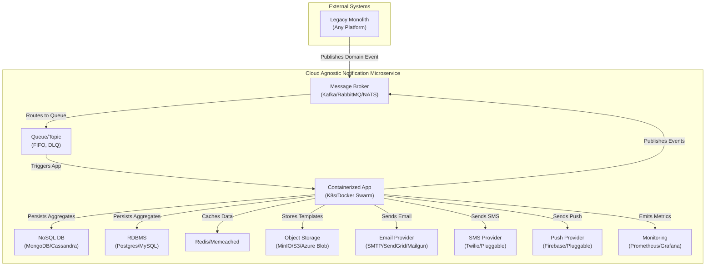

# Cloud Agnostic Notification Microservice Design

This design applies domain-driven design (DDD) principles to create a robust, scalable notification microservice that is cloud agnostic—meaning it can be deployed on any major cloud provider (AWS, Azure, GCP) or on-premises, with minimal changes to the core logic.

## Architecture Philosophy
"Abstract infrastructure, maximize portability, and maintain rich domain models." The solution uses open standards and portable technologies (e.g., containers, message brokers, NoSQL/SQL databases, cloud-neutral APIs) while applying DDD to ensure clean domain boundaries, rich behavior, and maintainable code.

## Domain-Driven Design Foundation

### Bounded Context: **Notification**
This microservice owns the complete lifecycle of notification processing—from request creation through delivery confirmation. It is agnostic to *why* notifications are needed (that's other bounded contexts), focusing only on *what* to send, *to whom*, *how*, and *when*.

### Core Aggregates

#### 1. **NotificationRequest** (Aggregate Root)
Represents the intent and lifecycle of sending a notification.

**Entities:**
- `Recipient` - Encapsulates recipient details with channel-specific addresses

**Value Objects:**
- `NotificationRequestId` - Unique identifier for the request
- `MessagePayload` - Content structure (title, body, rich content, data payload)
- `NotificationType` - Classification (e.g., "SystemAlert", "RequirementDue", "OrderConfirmed")
- `ChannelPreferences` - Ordered list of preferred channels with fallback logic
- `Urgency` - Priority level (High, Medium, Low)
- `ScheduledTime` - Optional delayed delivery timestamp
- `CorrelationId` - Links to originating business process
- `NotificationStatus` - Current state (Pending, Processing, Completed, Failed)

**Domain Behaviors:**
```csharp
public class NotificationRequest : AggregateRoot<NotificationRequestId>
{
    public static NotificationRequest Create(
        NotificationType type, 
        MessagePayload payload, 
        IEnumerable<Recipient> recipients,
        ChannelPreferences channelPrefs,
        CorrelationId correlationId)
    {
        // Validation and business rules
        var request = new NotificationRequest(/* parameters */);
        request.RaiseDomainEvent(new NotificationRequestedEvent(request.Id));
        return request;
    }

    public void MarkAsProcessing() { /* ... */ }
    public void MarkAsCompleted() { /* ... */ }
    public void MarkAsFailed(string reason) { /* ... */ }
}
```

#### 2. **SentNotificationLog** (Aggregate Root)
Tracks actual delivery attempts and outcomes for audit and monitoring.

**Entities:**
- `DeliveryAttempt` - Individual attempt records with timestamps and outcomes

**Value Objects:**
- `SentNotificationLogId` - Unique identifier
- `OriginalNotificationRequestId` - Reference to source request
- `ChannelType` - Delivery channel used
- `RecipientAddress` - Actual delivery address
- `DeliveryStatus` - Current delivery state
- `DeliveryTimestamp` - When delivery was attempted
- `FailureReason` - Error details if applicable

**Domain Behaviors:**
```csharp
public class SentNotificationLog : AggregateRoot<SentNotificationLogId>
{
    public static SentNotificationLog RecordDispatchAttempt(
        NotificationRequestId requestId,
        ChannelType channel,
        RecipientAddress address)
    {
        var log = new SentNotificationLog(requestId, channel, address);
        log.RaiseDomainEvent(new NotificationDispatchAttemptedEvent(log.Id));
        return log;
    }

    public void UpdateDeliveryStatus(DeliveryStatus status, string reason = null) { /* ... */ }
}
```

#### 3. **NotificationTemplate** (Aggregate Root)
Manages reusable notification templates with versioning support.

**Value Objects:**
- `TemplateId` - Unique identifier
- `TemplateName` - Human-readable name
- `ChannelType` - Target channel (Email, SMS, Push)
- `SubjectTemplate` - Subject line template (for email)
- `BodyTemplate` - Message body with placeholders
- `TemplateVersion` - Version tracking for backward compatibility
- `TemplateStatus` - Active, Draft, Deprecated

**Domain Behaviors:**
```csharp
public class NotificationTemplate : AggregateRoot<TemplateId>
{
    public NotificationTemplate CreateNewVersion(string bodyTemplate, string subjectTemplate = null) { /* ... */ }
    public RenderedMessage RenderMessage(IDictionary<string, object> data) { /* ... */ }
}
```

#### 4. **UserNotificationPreferences** (Aggregate Root)
Manages per-user notification settings and policies.

**Value Objects:**
- `UserId` - User identifier
- `NotificationTypePreference` - Per-type channel preferences
- `DoNotDisturbSchedule` - Quiet hours configuration
- `FrequencyLimits` - Rate limiting rules
- `ChannelSubscription` - Opt-in/opt-out status per channel

**Domain Behaviors:**
```csharp
public class UserNotificationPreferences : AggregateRoot<UserId>
{
    public void UpdateChannelPreference(NotificationType type, ChannelType channel, bool enabled) { /* ... */ }
    public bool ShouldReceiveNotification(NotificationType type, ChannelType channel, DateTime scheduledTime) { /* ... */ }
}
```

### Domain Events

- `NotificationRequestedEvent`
- `NotificationProcessingStartedEvent`
- `NotificationReadyToDispatchEvent`
- `NotificationDispatchAttemptedEvent`
- `NotificationSentToChannelEvent`
- `NotificationDeliveredEvent`
- `NotificationDeliveryFailedEvent`
- `NotificationFailedEvent`
- `NotificationCompletedEvent`
- `NotificationTemplateCreatedEvent`
- `NotificationTemplateVersionCreatedEvent`
- `NotificationTemplateDeprecatedEvent`
- `UserNotificationPreferencesUpdatedEvent`
- `NotificationReadEvent`

### Domain Services

- **NotificationDispatcherService:** Handles channel-specific delivery logic, retry policies, and error handling.
- **NotificationTemplatingService:** Manages template retrieval, caching, and message rendering.
- **NotificationPolicyService:** Enforces user preferences, rate limiting, and delivery policies.

### Channel Abstraction

```csharp
public abstract class NotificationChannel
{
    public abstract ChannelType Type { get; }
    public abstract Task<ChannelDeliveryResult> SendAsync(RenderedMessage message, Recipient recipient);
    public abstract bool SupportsDeliveryReceipts { get; }
    public abstract bool SupportsReadReceipts { get; }
}
```

## Cloud Agnostic Architecture Mapping

| DDD Component                | Cloud Agnostic Service/Pattern         | Implementation Notes                                  |
|------------------------------|----------------------------------------|-------------------------------------------------------|
| **Inbound Events**           | Message Broker (Kafka, RabbitMQ, NATS) | Event bus for decoupled event-driven communication    |
| **Application Services**     | Containerized App (Docker/K8s)         | Stateless microservices, scalable via orchestrators    |
| **Aggregate Persistence**    | NoSQL DB (MongoDB, Cassandra) or RDBMS | Choose based on portability and access patterns        |
| **Domain Events**            | Outbox Pattern + Broker                | Reliable event publishing, transactional outbox        |
| **Message Queuing**          | Broker Queues/Topics                   | FIFO/priority queues, DLQ for retries                 |
| **Caching**                  | Redis/Memcached                        | For template and preference caching                   |
| **Email Channel**            | SMTP Relay, SendGrid, Mailgun, etc.    | Pluggable email provider abstraction                  |
| **SMS/Push Channels**        | Twilio, Firebase, Pluggable APIs       | Multi-channel, provider-agnostic                      |
| **Template Storage**         | Object Storage (MinIO, S3, Azure Blob) | Templates in object store, metadata in DB             |
| **Monitoring**               | Prometheus, Grafana, OpenTelemetry     | Metrics, logs, and distributed tracing                |

## Architecture Diagram (Conceptual)



## Event-Driven Flow Example

1. Monolith or other system publishes a domain event to the message broker.
2. Notification microservice subscribes to relevant events via the broker.
3. Application service creates a NotificationRequest aggregate, validates, and persists it.
4. Domain events are published to the broker using the outbox pattern.
5. Policy and template services are invoked as needed.
6. Dispatcher service sends notifications via pluggable channel providers (email, SMS, push).
7. SentNotificationLog is updated with delivery outcomes.
8. Monitoring and metrics are emitted to the observability stack.

## Pros and Cons

| Pros | Cons |
|------|------|
| **Portability:** Deployable on any cloud or on-premises | **More integration work:** Need to abstract cloud-specific APIs |
| **No vendor lock-in:** Avoids dependence on a single provider | **May lack some managed features:** More ops responsibility |
| **Open standards:** Uses widely supported tech | **Scaling/HA:** Must be managed by your team |
| **Extensible:** Easy to add new channels/providers | **Monitoring/Tracing:** Must be set up and maintained |
| **Rich domain model:** DDD ensures maintainability | **Provider feature gaps:** Not all providers are equal |

## Implementation Recommendations

### Phase 1: Core Foundation
1. Implement basic aggregates (NotificationRequest, SentNotificationLog)
2. Set up message broker and containerized app
3. Configure database(s) for aggregate persistence
4. Implement pluggable email channel

### Phase 2: Enhanced Features
1. Add caching layer (Redis/Memcached)
2. Implement template management system
3. Add SMS and push notification channels
4. Set up monitoring and tracing

### Phase 3: Advanced Capabilities
1. User preference management
2. Rate limiting and policy enforcement
3. Advanced retry logic and circuit breakers
4. Read models for notification history queries

This design provides a portable, maintainable, and extensible notification microservice that can run on any cloud or on-premises, while maintaining strong domain boundaries and business logic.
